# Vehicle Service Extension Scenario
<!-- Please include descriptive title -->

<!--- Register repository https://api.reuse.software/register, then add REUSE badge:

-->

## Description
This sample demonstrates side by side extension on SSC v2 for vehicle service scenario. Please refer to below section "Reference Scenario" for scenario details.

## Reference Scenario
### Scenario
Please find the details of reference scenario in this section.\

Case is created by Service Advisor(CNS user) in Sales are Service Cloud, when customer requests for vehicle service.The case is created with custom case type, in this example- “Vehicle Service Case Type”.  Service Advisor captures information like- Individual customer, registered product(standard fields), along with milometer reading of vehicle(this is extension field in case). Registered product is also extended by adding vehicle Number(VIN) extension field.
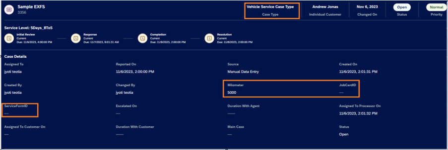 

Now, In SSC case, service advisor will fill service Form and create Job Card. This service Form is external application created using build apps and is embedded as mashup in one of tab of case. Please see the image below :
 

Here, as you can see, this Service Form shows data from CNS such as- vehicle number, DOP, milometer. 
Now, based on milometer , services are displayed. Service advisor choose service as per customer request, do some inspection, add notes and create JobCard by clicking on button –“Create JobCard”.
Now job card, can be viewed in one of custom tab as show below. Like service Form, this is also external UI application created via BuildApps.
Here as well, data like customer information is fetched from SSC.
 

Once Job Card is created, Service Form ID and Job Card ID extension fields which are added in case header are updated. Also, case status is changed to “Service Booked”. This is custom status. 
 

As next step- Service Supervisor will login to Job Card portal by clicking on “Job Portal” button in JobCard mashup to assign service technician for various services/tasks of the job card. Please see image below of external application which is also created using buildApps. 
 

 

Now, technician will login to job card portal and start the task/service. Technician can add some notes as well. Once service is started, the status of associated case in CNS is also set to “Service In Progress”. This is also custom status. Customer is also notified via email about this. Autoflow is configured is configured for sending emails.
Once all service is completed by technician, job card portal is updated and case status is set to “service completed”.

 

 

Job Card mashup, shows button to generate invoice,as shown above. Once clicked, invoice is generated and is available in case attachment list.
Service Advisor will review and can close the case.

**Validations :** We have also added validations in external application via External hooks feature. Consider the scenario where technicians has not completed the tasks , and service advisor is marking the case status as completed/closed. In this scenario, external validation should triggered and error message should be raised. Please refer the sceenshot below. Here, case status is service booked, and when we try to close the case, error is raised and case status is not changed.
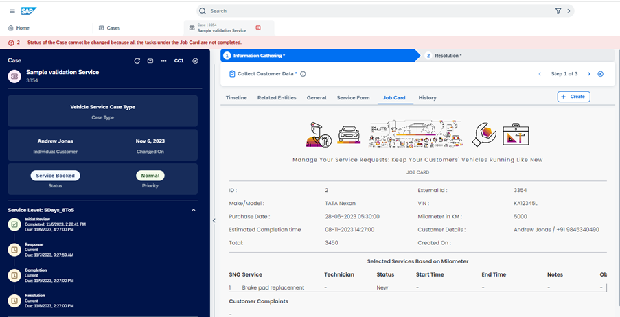 

### Scenario Diagram
Please refer to diagram below as well to understand scenario implementation done across different applications :

 

## Key Features
The key extension features covered in this implementations are - 
* Creating external application 
   * service/backend is developed using nestJS on top of node.js.
   * UI developed with low code no code tool- SAP BuildApps
   * Service is interacting with SAP sales and service cloud using Cloud SDK
   * Service is deployed in BTP Kyma instance
* Embedding external application in SAP sales and service cloud via mashup
* User propagation across different applications
* External validations via External hooks
* Extension configurations in SAP Sales and Service Cloud 

## Prerequisites
For this reference implementation, service(backend) is developed using nestJS on top of node.js. This service is deployed on BTP Kyma instance. UI is created in buildApps and extension is done via mashups in CNS.  
Below are the prerequisites along with link where you can learn more about them-
* Account and subaccount in SAP BTP , Kyma Instance runtime.
   * Refer [here](https://help.sap.com/docs/sap-hana-spatial-services/onboarding/introduction) to create account in BTP
   * Refer [here](https://discovery-center.cloud.sap/missiondetail/3019/3016/) to learn BTP
   * Refer [here](https://github.com/SAP-samples/kyma-runtime-extension-samples/tree/main/prerequisites#kyma) to know more about Kyma
* Kubectl - Install kubectl from below link
   * [Windows](https://kubernetes.io/docs/tasks/tools/install-kubectl-windows/)
   * [MacOS](https://kubernetes.io/docs/tasks/tools/install-kubectl-macos/)
* kubelogin plugin is required to proceed with Kubernetes authentication 
   * Homebrew (macOS and Linux) - brew install int128/kubelogin/kubelogin 
   * Chocolatey (Windows) - choco install kubelogin
   * Install krew from [here](https://krew.sigs.k8s.io/docs/user-guide/setup/install/)
   * Run - "kubectl krew install oidc-login"
* Install [Skaffold](https://skaffold.dev/docs/install/)
* Install Docker
* SAP BuildApps set up in BTP Account. Helpful links for setup
   * https://discovery-center.cloud.sap/serviceCatalog/sap-build-apps/?region=all
   * https://www.sap.com/india/products/technology-platform/low-code-app-builder.html
* NodeJS and NestJS Framework
* Cloud SDK. Learn from [here](https://sap.github.io/cloud-sdk/)
* Users in both SSC and BTP respectively
* HANA DB Account in BTP. In this reference implementation HANA DB is used.

## Running the application
Running applications includes below steps
* Configurations in sales and service cloud
* Download and deploy service in Kyma
* Download BuildApp applications and perform required changes
* Create Mashup in SSC
### Configurations in sales and service cloud
Before running this application, there are some configurations that needs to be done in Sales and Service Cloud.
* Create and Add below extension fields
   * Vehicle Number (VIN Number) – Created for Registered Product object and added in header section of Registered products object details screen. Screenshots below-

    

   

   *  Service Form ID – Created for Case
   * Job Card ID – Created for Case
   * Milometer- Created for case . All these extension fields added in header section of case object details screen.
   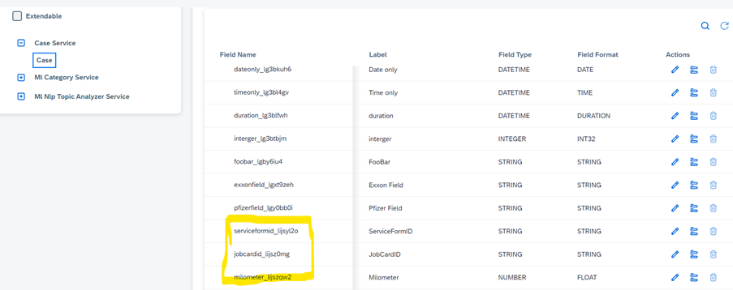

    

  [Refer](https://help.sap.com/docs/CX_NG_SALES/ea5ff8b9460a43cb8765a3c07d3421fe/d3bdfac0c6b141c0bac27408c3ed159f.html?locale=en-US&q=create%20extension%20fields%20in%20sales%20and%20service%20cloud%20verion%202) to know about how to create extension fields.
* Create Custom Case type
  * For this reference implementation – “vehicle service Case Type” case type needs to be created.
  * [Refer](https://help.sap.com/docs/CX_NG_SVC/56436b4e8fa84dc8b4408c7795a012c4/016d3122e3d347feb329a3523b537ff3.html?locale=en-US&q=case%20type) to know how to create custom case type.
* Create custom case status
  * create these three custom status for case - Service Booked , service In Progress and Service Completed respectively. These custom status is created for custom case type - "vehicle service case type".

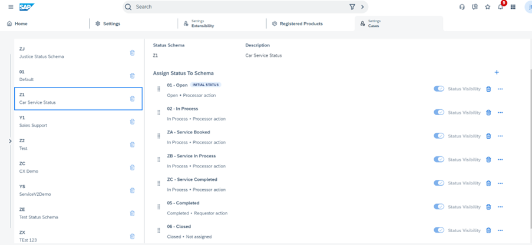 

  * In reference scenario, when job card is created,case status is updated to Service Booked.When technician starts the service, case status is updated to service in progress.When technician completes the service, case status is updated to service completed. This logic is written in external service.
  * [Refer](https://help.sap.com/docs/CX_NG_SVC/56436b4e8fa84dc8b4408c7795a012c4/be263fba54584ed6af0a670b4bfaafc2.html?locale=en-US&q=case%20status) to know how to create custom status.
* Please note the IDs of extension fields, case type and custom case status. It will be used furthur in service.
### Download and deploy service in Kyma
Please follow below steps to download and deploy service in Kyma.
1. Create XSUAA/destination service instances
Since our application uses destination to connect to services in CNS, we need to create service instance and service binding for both destination and xsuaa. (XSUAA will be used to fetch credentials required to connect to the destination service)
Please refer [this](https://blogs.sap.com/2022/07/12/the-new-way-to-consume-service-bindings-on-kyma-runtime/)to understand how services - destination service and xsuaa service are consumed in an application in kyma.
  * add the SERVICE_BINDING_ROOT env variable into your deployment: https://github.tools.sap/fp-stakeholder-management/xsuaa-approuter/blob/main/approuter/helm/app1-app/templates/deployment.yaml#L91
  * create a volume with your dest service binding secret: https://github.tools.sap/fp-stakeholder-management/xsuaa-approuter/blob/main/approuter/helm/app1-app/templates/deployment.yaml#L91
  * create a volume mount with a path to the binding secret: https://github.tools.sap/fp-stakeholder-management/xsuaa-approuter/blob/main/approuter/helm/app1-app/templates/deployment.yaml#L69
  * NOTE: Once you create XSUAA instance, a secret will be created which will have details like ClientID, clientSecret, tokenURL etc which will be needed in the following steps
2. Create Destinations in BTP:\
  There will be two Destinations -
    * First, used by buildapps to connect the application in kyma:\

    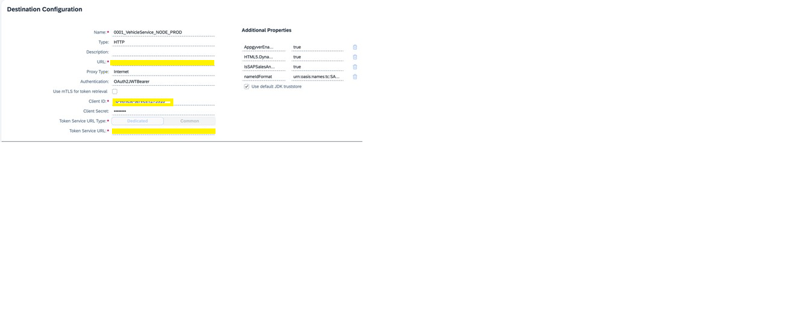 
      Type: HTTP\
      URL: Application URL\
      Authentication: OAuth2JWTBearer\
      ClientId, ClientSecret, Token Service URL: You will get this info from the xsuaa instance secret created in the previous step. OAuth2JWTBearer destination type can help exchange the user JWT token into an OAuth2 bearer access token with the required scopes

   To allow an application to call another application, passing the user context, and fetch resources, the caller application(In our case, this is the build apps application) must pass an access token. In this authorization flow, the initial user token is passed to the OAuth server as input data. This process is performed automatically by the Destination service, which helps simplifying the application development: You only have to construct the right request to the target URL, by using the outcome (another access token) of the service-side automation.
  * Second, Used by the application in kyma to connect to service in CNS:
  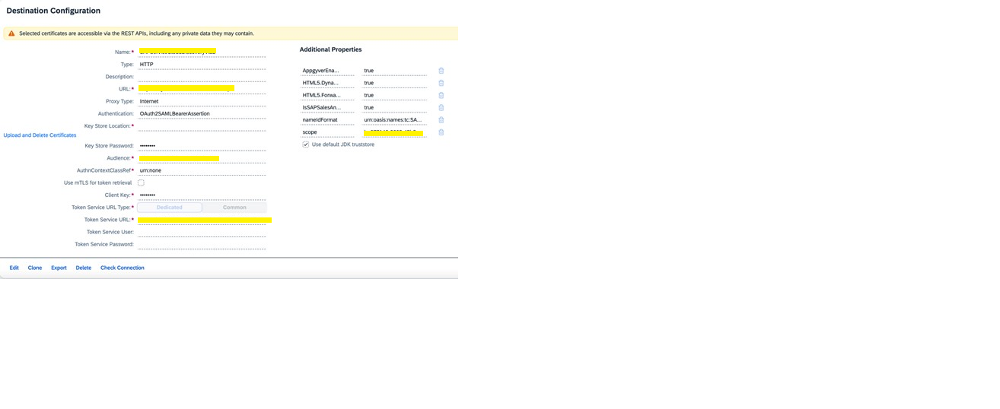
   OAuth2SAMLBearerAssertion authorisation flow allows for propagation of a user’s identity from our application deployed in kyma to the service we are trying to connect in Sales and Cloud Service.
3. Create Hana DB to instance
   * Follow [this](https://blogs.sap.com/2022/12/15/consuming-sap-hana-cloud-from-the-kyma-environment/) to consume HANA DB in Kyma
   * This will create a Kubernetes secret from where we can get the details required to connect to the DB
4. Create Kubernetes secrets
    * Create a Kubernetes secret file(with the name <application-name>-secrets) to store sensitive data like db username/password and other application specific data.
    * The secret should contain the following:
    case_status_booked: <Status code when case status is booked>
    case_status_closed: <Status code when case status is closed>
    case_status_completed: <Status code when case status is completed>
    case_status_service_completed: <Status code when case status service completed>
    case_status_service_in_process: <Status code when case status is service in process>
    db_password: <Database password. This is available in the secret that’s created in the above step>
    db_user: <Database username. This is available in the secret that’s created in the above step>
    destination: <Destination to which the application connects>
    dropSchema: <Drops the schema each time connection is being established. This option is useful during debug and development>
    extension_field_jobcard_id: <Job Card ID extension field>
    extension_field_milometer: <Milometer extension field>
    extension_field_service_form_id: <Service Form ID extension field>
    extension_field_vehicle_number: <Vehicle Number extension field>
    logLevel: <Sets the log level of the application>
    synchronize: <Indicates if database schema should be auto created on every application launch. This option is useful during debug and development >
    * You will notice this secrets contains IDs for configurations done in sales and service cloud like extension fields, Case status. The reason being different IDs which is generated when fields are created. In our service code, we are refering to IDs maintained here in business logic.
5. Prepare Deployment Description File\
   Based on our application specification, we define the following description file for deployment. This yaml file can be found inside k8s folder.
   NOTE: In APIRule, we have configured an access strategy to restrict access to the application. We will be using the JWT access strategy to protect endpoint(s) from unsolicited access.
6. Use "deploy.sh" (In root directory) to deploy the service to Kyma\
This is a script which does two things:
- Build the application
- Deploy to Kyma cluster using scaffold\

Alternatively, please follow the steps below to deploy your service to Kyma:
* Build the application
*  Build docker image:
To create docker image we use the following docker file(This DockerFile is available in the root directory of the application):
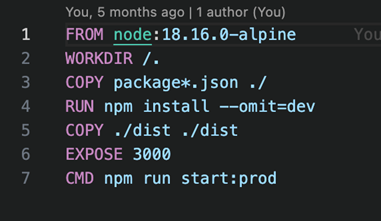
* Use command - "docker build -t <docker-hub-account>/<image-name>:v1" to build docker image based on the above dockerfile.This   command should be run in the same level where the DockerFile is present
*  Push the docker image to a container repository.\
We will be using docker hub to store the image we created in the previous step.
   * Log in to Docker using this command: docker login -u <docker-id> -p <password>
   * Push the local image into the Docker Hub using command : docker push <docker-hub-account>/<image-name>:v1
   * Deploy the application using the deployment description file created in step 5:
kubectl -n dev apply -f k8s-deployment-backend.yaml

#### Add Authentication 
This section will explain how to enable authentication for service and how user propagation between SSC and external application is acheived.
* Enable BTP authentication in SAP Buildapps - https://blogs.sap.com/2022/07/01/using-btp-authentication-and-destinations-with-sap-appgyver/
This will create an xsuaa instance in BTP
* Create a destination with the following configuration for the build apps to connect: \
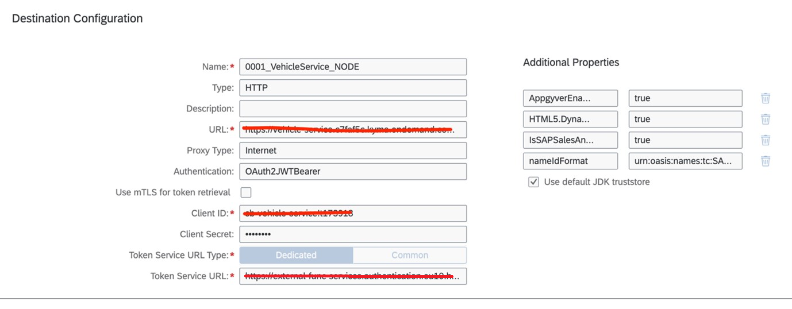
OAuth2JWTBearer destination type can help exchange the user JWT token into an OAuth2 bearer access token with the required scopes
* To allow an application to call another application, passing the user context, and fetch resources, the caller application(In our case, this is the build apps application) must pass an access token. In this authorization flow, the initial user token is passed to the OAuth server as input data. This process is performed automatically by the Destination service, which helps simplifying the application development: You only have to construct the right request to the target URL, by using the outcome (another access token) of the service-side automation.
* API rule definition for the service deployed in Kyma-
API rule CRD(custom resource definition) can offer a number of access strategies to help restrict access to exposed endpoints. In our case, we will be using the JWT access strategy as a way to protect an API rule endpoint(s) from unsolicited access.
To setup API rule CRD with access strategy:
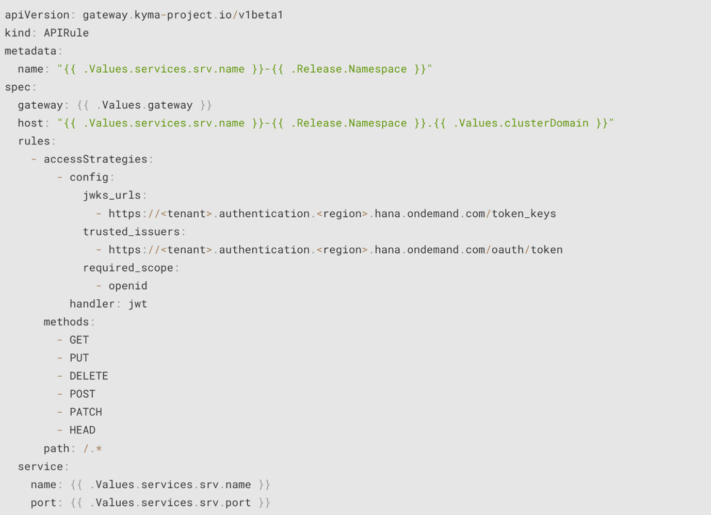
* With this API rule definition, the application hosted in kyma will have access to the user JWT token.\
NOTE:
An XSUAA instance must be created whose clientid, client secret we will be using in step 2 above.\
To create an XSUAA instance, follow https://help.sap.com/docs/btp/sap-business-technology-platform/using-sap-btp-services-in-kyma-environment. Once the service binding is created, it will create a Kubernetes secrets which will have the clientid, client secret info.

#### Code Folder Structure
This section will help in understanding the code structure and important methods of service.

Details of "src" folder is below:

*cns-modules*

* It contains files/folders where code to connect with cns modules/api is written. Calling cns api is done via cloud SDK, which uses openAPI specs.
* In this reference, requirement involves connection with these cns entities- case, Individual customer, Accounts  and Registered product respectively .
* As shown in screenshot above, we have folder with same name. Customer folder includes connection with entities- Individual customer and Accounts.
* If you drill down, any one folder, for eg- case, you will find open-api folder which has specification file which is downloaded from API hub(https://api.sap.com/)
Here you will find specs for Case - https://api.sap.com/api/SalesSvcCloudV2_case/overview
*  Other TS files contains application logic to call CNS APIs via Cloud SDK. Example- cases.service.ts -> updateCase method. As name suggests, case is updated from here. Please notice the function call where destination and jwt Token is passed.

*Common* 

Contains files/folder for common/generic handling in application- like errors, exceptions, interceptors, middleware, base repository layer.

*Database*

It is to handle DB transaction logic.

*extension-modules*

It contains modules related to extension logic. All modules are based on standard pattern of controller, service, repository layer respectively.
Additionally, you will find dto and entities related files/folder.
Also, translation is taken care of. Refer the resource file added in i18n.

*Health*

To check the health of our service. This is mainly used by Kubernetes for any service health issue. 

*Logger*

Implementation of logger for our service. Logs can be checked in Kyma instance in BTP.

*Utils*
Contains files with util methods used across application.

#### Validations via External hooks

We have implemented validation in our external application. If any user is changing the case status to closed/completed, we are validating if tasks are completed by technicians or not. If tasks are not completed, which means case status is not- service completed, we are not allowing, case to be closed in SSC. this validation is done in service via external hooks. 

Please refer this document for details on external hooks and how it can be configured.

### Build Apps Configuration
By following these documented instructions, users will be able to download the reference buildapps application , deploy and run. \
Please click the link to download the below build apps sample application   
 
-  Service form  
-  JobCard 
-  Job Portal  

#### How to start
**Step 1:** Open the build apps dashboard to import the downloaded  attachment.

Begin by launching the Build Apps Dashboard to initiate the process of importing the downloaded attachment. 
 
**Step 2:** Click the "Import" button to import the downloaded .mtar file. 
 
In this step, you can easily import the downloaded .mtar file. This allows users to reference and check the downloaded file while providing the foundation for creating their unique application. 
 

**Step 3:** Open the imported Build app application (service Form ). 
 
In this step, users have the option to either open an already imported Build Apps application (Service Form) or create a brand new Build Apps application. This flexibility empowers users to design application forms, pages, and more using a diverse range of components, layouts, and elements such as buttons, links, input fields, and more. This allows users to tailor their applications to their specific needs and preferences. 

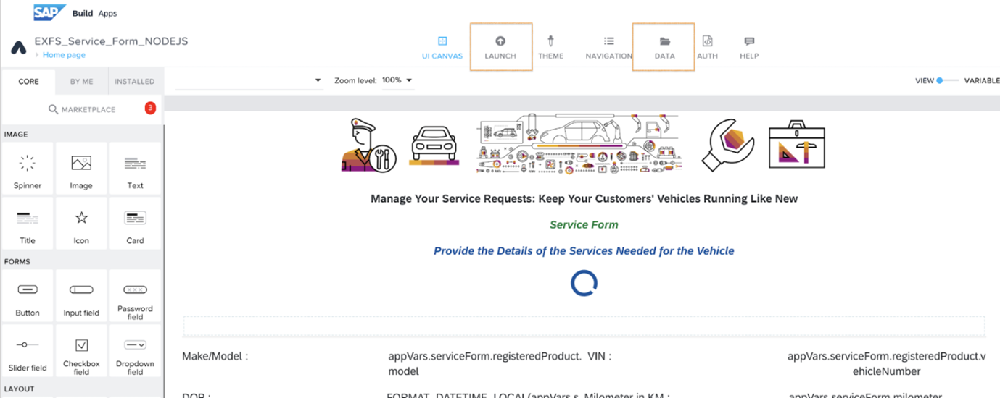

**Step 4:** Click on "Data" and under data entities, select "Eg : ( VS) " Choose the configured "BTP Destination name." Repeat this step for other data entities as necessary. 
 
In this step, by configuring "BTP Destination," users gain the ability to connect to various data sources, facilitating data processing within their application.  
 
The process of adding BTP Destinations is explained in the "Service" creation steps.  
 
This empowering procedure allows users to efficiently utilize and process data, connecting to different sources as required. It significantly enhances the flexibility and adaptability of their application. 
 
 
**Step 5:** Click the "Launch" button on the top menu. Click "Open Build service" and under "Web App" click "Build" Select ".mtar" , choose the runtime version and enter the app version (e.g., "1.0.0") -  Click "Build" 
 
In this step, users are guided through the process of building and deploying their application. By following these instructions, users can choose different runtime versions and specify the application version (e.g., "1.0.1"). Importantly, users have the flexibility to build their application multiple times with different versions as needed. This step empowers users to prepare their applications for deployment and further usage. 

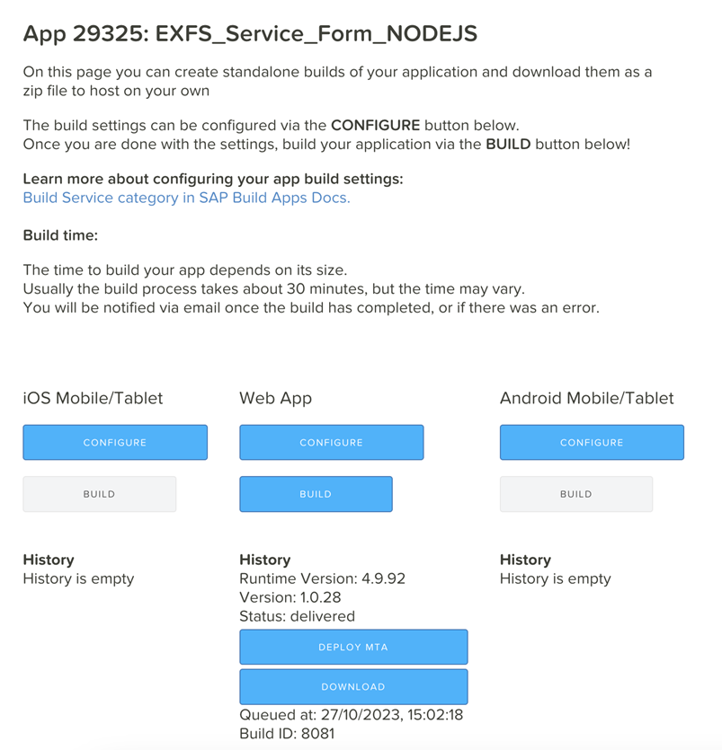

**Step 6:** After some time, on the same page, once the status changes to "Delivered," click "Deploy MTA.". Follow the popup window and deploy the application. 
 
In this step, users can deploy their application, and once the status changes to "Delivered," they can click "Deploy MTA." Following this, a popup window will guide users through the deployment process. After successfully deploying the application, users will receive the URL. This URL allows end-users to access and utilize the application.

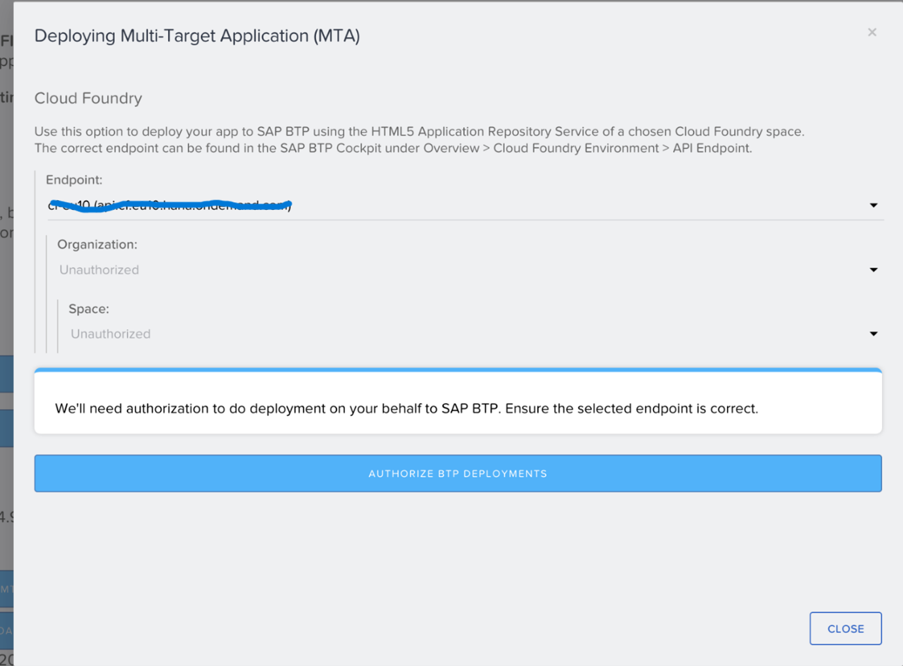

**Step 7 :** Follow the same steps for "Job card" and “Job portal” application  as described above.

**Step 8:** NOTE: When using a BTP destination for a data entity, PATCH requests currently do not work with sub-collection endpoints, such as /parent/{parentId}/child/{childId}. 
 
Workaround Solution: So, when a PATCH request is required with a sub-collection endpoint, try to use a direct HTTP PATCH request instead of a BTP destination. 
 
Example: In the "Job portal" sample application, please refer to the Submit / Start / Complete button component event flow. 

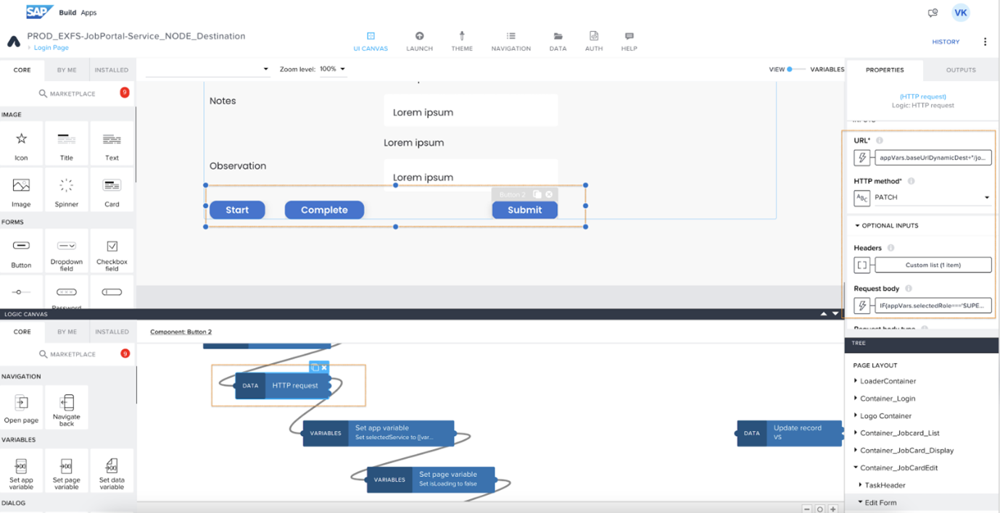
 
### Add external application UI via mashup in SSC
**Step 1:** Go to CNS Application  
 
**Step 2:** In the settings, navigate to "Mashup Authoring" and create a new mashup (Service Form). 
 
 
**Step 3:** In the URL field of the mashup, add the copied URL. Also, add a parameter, "caseId." Save the mashup. 
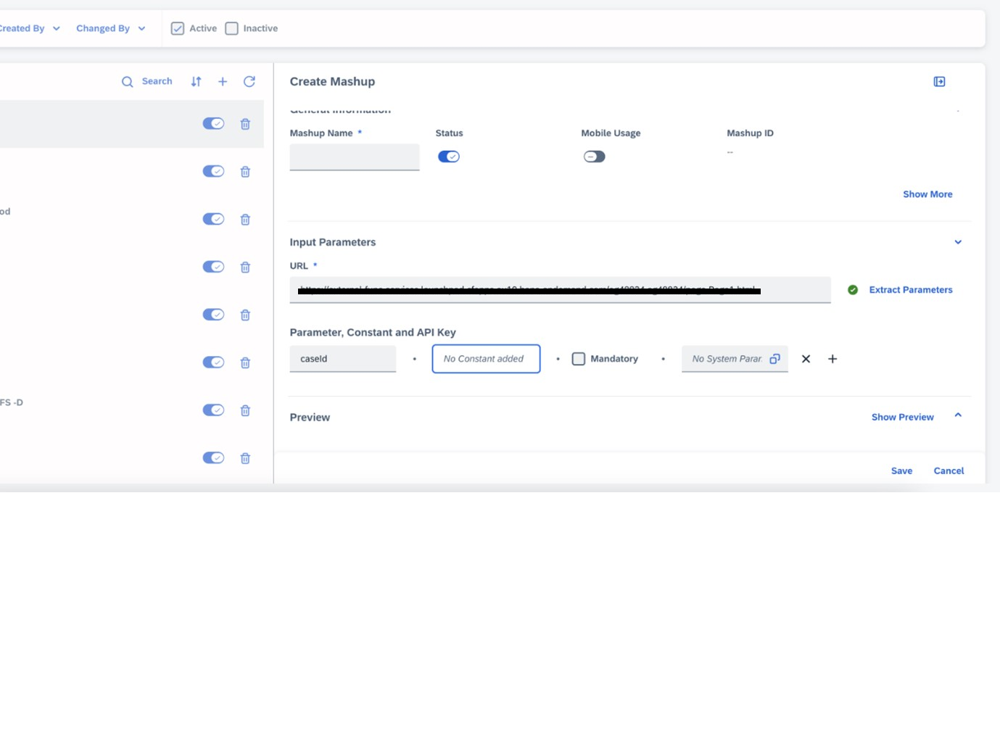

**Step 4:** Go to "Case," open CaseUI , and start adaption. 
 
**Step 5:** Create a new tab  and add the mashup you created in step 3. Map the parameter (e.g., caseId = case/Id).
 

**Step 6:** Follow the same steps for "Job card" as described above. 

Refer [this](https://help.sap.com/docs/CX_NG_SALES/ea5ff8b9460a43cb8765a3c07d3421fe/007ce4c89b6a45a39cff5d26186dfab0.html?locale=en-US&q=create%20extension%20fields%20in%20sales%20and%20service%20cloud%20verion%202) help document for more information on mashups

## Known Issues
No knowns issues

## How to obtain support
[Create an issue](https://github.com/SAP-samples/<repository-name>/issues) in this repository if you find a bug or have questions about the content.
 
For additional support, [ask a question in SAP Community](https://answers.sap.com/questions/ask.html).

## Contributing
If you wish to contribute code, offer fixes or improvements, please send a pull request. Due to legal reasons, contributors will be asked to accept a DCO when they create the first pull request to this project. This happens in an automated fashion during the submission process. SAP uses [the standard DCO text of the Linux Foundation](https://developercertificate.org/).

## License
Copyright (c) 2023 SAP SE or an SAP affiliate company. All rights reserved. This project is licensed under the Apache Software License, version 2.0 except as noted otherwise in the [LICENSE](LICENSE) file.
