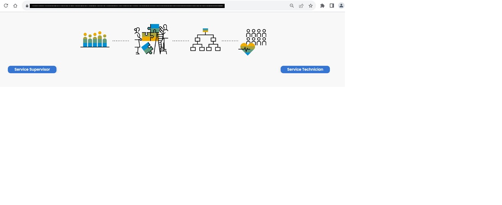
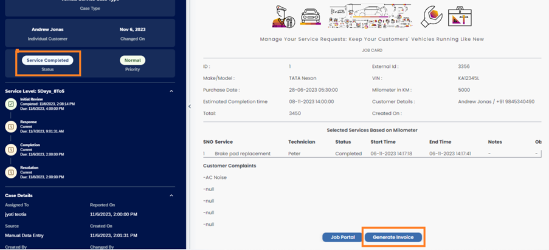

## Reference Scenario
### Scenario
Please find the details of reference scenario in this section.

As a service advisor, you create a case with the custom case type 'Vehicle Service Case Type' when a customer requests vehicle service. 2.	Update all the information such as Individual Customer, Registered Product (standard fields), along with milometer reading of the vehicle (this is the extension field in case). 
The Registered product is also extended by adding the Vehicle Number (VIN) extension field

 

Fill the Service Form by choosing the services displayed based on milometer, inspections from the list, and add notes. This service Form is created via an external application using buildApps and is embedded as mashup in one of the tabs of the case. 
Please see the image below :

 

Here, as you can see, this Service Form shows data from CNS such as- vehicle number, DOP, milometer. 
Now,Create your job card. You can view the job card in one of the custom tabs. This is also created via external UI application using BuildApps. You can also fetch the customer details from the solution.

 

Once the Job Card is created, Service Form ID and Job Card ID extension fields in the case header are updated, and the case status is changed to ‘Service Booked’. This is the custom status.  
 

As a Service Supervisor, log into Job Card portal by clicking ‘Job Portal’ button in the ‘Job Card, mashup to assign service technician for various services/tasks of the job card. 
The following image shows the external application that is created using buildApps. 
 
 

 

As a technician, you can log into the Job Card portal, start the task/service, and add notes. Once the service is started, the status of associated case in the solution is set to ‘Service In Progress’ which is a custom status. Customers are also notified via email with an autoflow configured for sending emails.

Once all the services are completed by the technician, job card portal is updated and case status is set to ‘Service Completed’.

 

 

To generate the invoice, click the ‘Generate Invoice’ button available under the Job Card mashup. Access this generated invoice from the case attachment list.
As a Service Advisor, review and then close the case.

**Validations :** We have also added validations in external application via External hooks feature. Consider the scenario where technicians have not completed the tasks, and service advisor is marking the case status as completed/closed. In this scenario, external validation should trigger, and error message should be raised. 
The following screenshot shows the case status is ‘Service Booked’, and when you try to close the case, error is raised, and case status is not changed.

 

### Scenario Diagram
Refer to the following diagram to understand the scenario implementation done across different applications:

 
